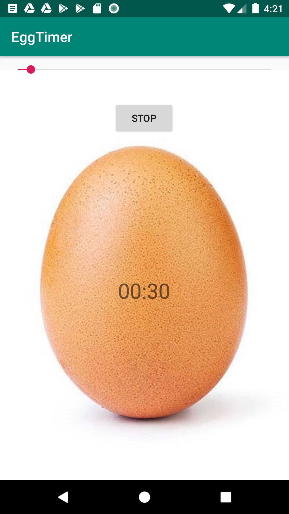

# android_timer_starter_code
This Android app is a simple countdown timer. You can set the timer using the seekbar and start the time using the start button. When the timer reaches zero, it will make a siren sound. You can use this code to get an idea about how integrate seedbar, how to use CountDownTimer and play audio.
This app is not available in AppStore. So feel free to change this code and use in your application. 

Note: remove the screenshot of the app inside the drawable before using :) .

Thank you.

[Oreo Development Course](https://www.udemy.com/share/101Y5MAkMcdl5bRXo=/)
